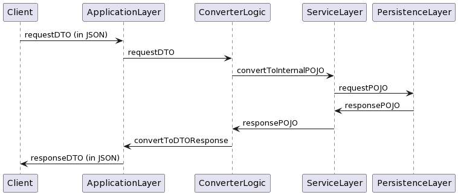

# Architectural Overview

HungryTales is built using Spring Boot and apache maven. 

I didn't use any complicated design patterns to keep the implementation simple yet flexible, instead I chose
to inject interfaces between core layers of the system to keep cognitive complexity low but still enable flexible and 
scalable solutions.

At it's core, the project consists of 4 modules:

1. Application
2. Common
3. Service
4. Storage/Persistence

The general flow of client requests as I envisioned them is shown below.

(Note that the `ConverterLogic` lives in the application layer).

This design let's me create Application specific endpoints (gRPC vs HTTP) simply by implementing the protocl and behavior 
and then composing the business behavior requirements from a pair of service and persistence layer implementations.

# Modules

## Application Module

The Application module describes the application layer, both the bootstrap and the high level protocol in use.

The main class, `xyz.slimjim.hungrytales.HungrytalesApplication` bootstraps the Spring Boot application and configures some parameters for the CORS layer.

Underneath the main class, is the `xyz.slimjim.hungrytales.web` package that then bootstraps the HTTP controllers.

This package contains all the necessary config and types to successfully operate the web layer, including middleware and HTTP endpoints.

## Common Module

Contains interal data types common to the application, service and storage modules

## Service

The interface separating application level logic (protocols and endpoints) from business logic.

Recipe and Authentication logic both have their own Service interface definitions and corresponding implementations. 
These are currently implemented as Spring beans and operate against internal POJOs (and not the application layer DTOs).

## Storage

The storage module defines the persistence layer. 

Each service has it's own persitence layer requirements and refers to this layer via exported interfaces. 

It is currently a postgres implementation with a manual processor that maps object values to prepared statements, but it 
could easily be swapped out for an ORM such as hibernate.

# Features

## Authentication

Users must sign up via the `/auth/register` endpoint, after which they need to retrieve a login token by calling the
`/auth/login` endpoint. 

This token must be presented in the `Authorization: Bearer <Token>` Header, otherwise they will receive a 401.

## Recipes

Registered users can create, get, edit, delete and list all recipes stored in the server. 